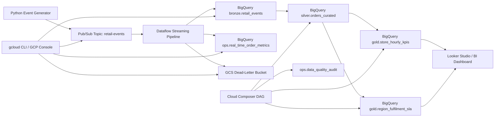

# RetailPulse: Real-Time Order Analytics Platform on GCP

RetailPulse is an interview-ready, end-to-end GCP Data Engineering project that simulates an online retail business streaming order lifecycle events in real time. It shows how to ingest, validate, process, warehouse, and operationalize streaming data using native GCP services and production-style design patterns.

## Why this project works for interviews

- Solves a realistic business problem: near real-time visibility into orders, revenue, payment success, and fulfilment SLAs.
- Uses core GCP data engineering services that hiring teams expect: Pub/Sub, Dataflow, BigQuery, Cloud Storage, and Cloud Composer.
- Demonstrates both streaming and warehouse modeling patterns: schema validation, deduplication, late-arriving data handling, bronze/silver/gold design, and data quality auditing.
- Includes both automated `gcloud` setup and a manual GCP Console path so the project is easy to reproduce.
- Gives you concrete material for resume bullets, architecture discussions, and follow-up interview questions.

## Business scenario

An e-commerce company wants a streaming data platform that can:

- ingest order events from multiple stores in real time,
- power live operational dashboards,
- track payment and shipment status across the order lifecycle,
- expose curated BigQuery tables for analysts and BI dashboards,
- capture invalid records for replay and troubleshooting.

## End-to-end architecture



## GCP services and tooling

- Pub/Sub for event ingestion
- Dataflow (Apache Beam) for streaming ETL
- BigQuery for bronze, silver, gold, and operational metrics tables
- Cloud Storage for dead-letter and Dataflow temp/staging buckets
- Cloud Composer for scheduled warehouse transformations and data quality checks
- gcloud CLI and PowerShell for automated setup
- Looker Studio for dashboarding

## Project structure

```text
.
|-- config/
|   `-- pipeline_config.example.json
|-- docs/
|   |-- architecture.md
|   |-- interview-guide.md
|   |-- manual-gcp-setup.md
|   `-- resume-kit.md
|-- infra/
|   `-- terraform/
|       |-- main.tf
|       |-- outputs.tf
|       |-- terraform.tfvars.example
|       |-- variables.tf
|       |-- versions.tf
|       `-- schemas/
|           |-- data_quality_audit.json
|           |-- raw_events.json
|           `-- realtime_metrics.json
|-- scripts/
|   `-- gcloud/
|       `-- setup_retailpulse.ps1
|-- orchestration/
|   `-- composer/
|       `-- retailpulse_realtime_dag.py
|-- sql/
|   |-- 01_create_objects.sql
|   |-- 02_silver_orders_curated.sql
|   |-- 03_gold_business_kpis.sql
|   `-- 04_data_quality_checks.sql
|-- src/
|   |-- __init__.py
|   |-- producer/
|   |   `-- order_events_producer.py
|   `-- streaming/
|       |-- __init__.py
|       |-- pipeline.py
|       |-- schemas.py
|       `-- transforms.py
|-- tests/
|   `-- test_transforms.py
`-- requirements.txt
```

## Technical highlights you can speak about

- Streaming validation with a dead-letter pattern for malformed events
- Windowed deduplication by `event_id` in Dataflow
- Real-time operational metrics written directly from the streaming pipeline
- BigQuery partitioning and clustering for cost and performance control
- Bronze, silver, gold data modeling strategy
- Composer-driven downstream SQL transformations and data quality checks
- Repeatable environment setup with `gcloud` automation and a manual console guide

## Data model

### Event types

- `ORDER_CREATED`
- `PAYMENT_CAPTURED`
- `SHIPMENT_DISPATCHED`
- `DELIVERY_COMPLETED`

### Core tables

- `bronze.retail_events`
  Raw but validated streaming events from Pub/Sub
- `ops.real_time_order_metrics`
  One-minute window operational metrics for live dashboards
- `silver.orders_curated`
  Order-level current-state view with payment and shipment enrichment
- `gold.store_hourly_kpis`
  Store and region level revenue, order, and fulfilment KPIs
- `gold.region_fulfilment_sla`
  Region-level delivery SLA metrics
- `ops.data_quality_audit`
  Quality check outputs for observability and governance

## How to run

### 1. Provision core GCP resources

Option A: run the PowerShell setup script

```powershell
powershell -ExecutionPolicy Bypass -File .\scripts\gcloud\setup_retailpulse.ps1 `
  -ProjectId your-gcp-project-id `
  -Region us-central1 `
  -DatasetLocation US
```

Option B: follow the manual console guide in [manual-gcp-setup.md](/C:/Users/Srinivas%20Porandla/OneDrive/Documents/New%20project/docs/manual-gcp-setup.md)

### 2. Create or refresh BigQuery objects

Run the SQL files in order inside BigQuery. Start with `sql/01_create_objects.sql`.

### 3. Install dependencies

```powershell
python -m venv .venv
.venv\Scripts\activate
pip install -r requirements.txt
```

### 4. Start the Dataflow streaming job

```powershell
python -m src.streaming.pipeline `
  --project_id=your-gcp-project-id `
  --region=us-central1 `
  --input_subscription=projects/your-gcp-project-id/subscriptions/retail-events-sub `
  --raw_table=your-gcp-project-id:bronze.retail_events `
  --metrics_table=your-gcp-project-id:ops.real_time_order_metrics `
  --dead_letter_path=gs://your-gcp-project-id-retailpulse-raw/dead-letter/retail-events `
  --temp_location=gs://your-gcp-project-id-retailpulse-temp/dataflow/temp `
  --staging_location=gs://your-gcp-project-id-retailpulse-temp/dataflow/staging `
  --runner=DataflowRunner
```

### 5. Publish simulated events

```powershell
python -m src.producer.order_events_producer `
  --project_id=your-gcp-project-id `
  --topic_id=retail-events `
  --event_count=500 `
  --sleep_seconds=0.5
```

### 6. Deploy the Composer DAG

Copy `orchestration/composer/retailpulse_realtime_dag.py` and the `sql/` folder to your Composer DAG bucket. The DAG runs hourly to build silver and gold tables and write DQ audit results.

## Suggested dashboard metrics

- orders per minute
- gross revenue by store and region
- average order value
- payment capture rate
- shipment dispatch lag
- on-time delivery percentage

## Resume and interview help

- Resume-ready bullets: `docs/resume-kit.md`
- Architecture deep dive: `docs/architecture.md`
- Manual setup walkthrough: `docs/manual-gcp-setup.md`
- Mock interview talking points: `docs/interview-guide.md`

## How to present this in an interview

Tell the story in this order:

1. Business problem and why real-time data matters.
2. Event ingestion and streaming validation with Pub/Sub and Dataflow.
3. BigQuery modeling from bronze to gold.
4. Operational monitoring, replay strategy, and data quality checks.
5. Cost and performance optimizations.
6. Impact metrics from your demo run or benchmark.
