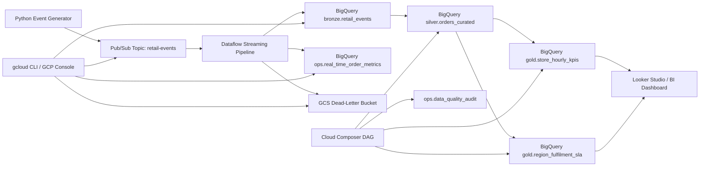

# RetailPulse: Real-Time Order Analytics Platform on GCP

Portfolio project for `GCP Data Engineering`, `streaming ETL`, and `BigQuery` analytics.

RetailPulse is an end-to-end real-time data platform that simulates e-commerce order lifecycle events, processes them with `Pub/Sub` and `Dataflow`, stores them in `BigQuery` using `bronze/silver/gold` modeling, and orchestrates downstream transformations with `Cloud Composer`.

## Why This Repo Is Worth Reviewing

- Demonstrates a complete streaming pipeline instead of only isolated scripts.
- Uses core GCP data engineering services commonly expected in interviews.
- Shows production-style patterns: schema validation, dead-letter handling, deduplication, data quality checks, partitioning, and clustering.
- Connects technical design to business outcomes such as revenue visibility, payment tracking, and fulfilment SLA monitoring.

## Project Snapshot

Business problem:
An e-commerce company needs near real-time visibility into orders, payments, shipments, and fulfilment performance.

What the pipeline does:

- ingests order events through `Pub/Sub`
- validates and processes events in `Dataflow`
- writes raw and operational outputs to `BigQuery`
- builds `bronze`, `silver`, and `gold` analytical layers
- schedules curated SQL transformations with `Cloud Composer`
- captures bad records for replay through a dead-letter pattern

## Architecture



## Tech Stack

- `GCP`: Pub/Sub, Dataflow, BigQuery, Cloud Storage, Cloud Composer
- `Languages`: Python, SQL, PowerShell
- `Frameworks and Tools`: Apache Beam, Airflow, `gcloud` CLI
- `Patterns`: streaming ETL, bronze/silver/gold modeling, dead-letter design, data quality auditing

## What This Project Demonstrates

- Real-time event ingestion and stream processing on GCP
- BigQuery warehouse modeling for analytics and operational reporting
- Window-based deduplication by `event_id`
- Late-arriving data handling and bad record isolation
- Cost-aware table design using partitioning and clustering
- Orchestrated downstream SQL jobs for silver, gold, and DQ layers

## Data Model

| Layer | Table | Purpose |
|---|---|---|
| `bronze` | `retail_events` | validated event-level streaming data |
| `ops` | `real_time_order_metrics` | one-minute operational dashboard metrics |
| `silver` | `orders_curated` | order-level current-state analytics |
| `gold` | `store_hourly_kpis` | store and region revenue/order KPIs |
| `gold` | `region_fulfilment_sla` | fulfilment SLA and dispatch performance |
| `ops` | `data_quality_audit` | warehouse quality check outcomes |

## Business KPIs

- orders per minute
- gross revenue by store and region
- average order value
- payment capture rate
- dispatch lag
- on-time delivery percentage

## Quick Start

### 1. Provision core resources

Option A: automated setup

```powershell
powershell -ExecutionPolicy Bypass -File .\scripts\gcloud\setup_retailpulse.ps1 `
  -ProjectId your-gcp-project-id `
  -Region us-central1 `
  -DatasetLocation US
```

Option B: manual setup

- Follow [docs/manual-gcp-setup.md](docs/manual-gcp-setup.md)

### 2. Create base tables

- Run [sql/01_create_objects.sql](sql/01_create_objects.sql) after replacing `your-gcp-project-id`

### 3. Install dependencies

```powershell
python -m venv .venv
.venv\Scripts\activate
pip install -r requirements.txt
```

### 4. Run the streaming pipeline

```powershell
python -m src.streaming.pipeline `
  --project_id=your-gcp-project-id `
  --region=us-central1 `
  --input_subscription=projects/your-gcp-project-id/subscriptions/retail-events-sub `
  --raw_table=your-gcp-project-id:bronze.retail_events `
  --metrics_table=your-gcp-project-id:ops.real_time_order_metrics `
  --dead_letter_path=gs://your-gcp-project-id-retailpulse-raw/dead-letter/retail-events `
  --temp_location=gs://your-gcp-project-id-retailpulse-temp/dataflow/temp `
  --staging_location=gs://your-gcp-project-id-retailpulse-temp/dataflow/staging `
  --runner=DataflowRunner
```

### 5. Publish sample events

```powershell
python -m src.producer.order_events_producer `
  --project_id=your-gcp-project-id `
  --topic_id=retail-events `
  --event_count=500 `
  --sleep_seconds=0.5
```

### 6. Build curated layers

- Run [sql/02_silver_orders_curated.sql](sql/02_silver_orders_curated.sql)
- Run [sql/03_gold_business_kpis.sql](sql/03_gold_business_kpis.sql)
- Run [sql/04_data_quality_checks.sql](sql/04_data_quality_checks.sql)
- Or deploy [orchestration/composer/retailpulse_realtime_dag.py](orchestration/composer/retailpulse_realtime_dag.py)

## Key Files

- Streaming pipeline: [src/streaming/pipeline.py](src/streaming/pipeline.py)
- Transform logic: [src/streaming/transforms.py](src/streaming/transforms.py)
- Event producer: [src/producer/order_events_producer.py](src/producer/order_events_producer.py)
- Composer DAG: [orchestration/composer/retailpulse_realtime_dag.py](orchestration/composer/retailpulse_realtime_dag.py)
- Architecture notes: [docs/architecture.md](docs/architecture.md)
- Interview prep: [docs/interview-guide.md](docs/interview-guide.md)
- Resume bullets: [docs/resume-kit.md](docs/resume-kit.md)

## Interview Talking Points

- Why `Pub/Sub + Dataflow` is a strong fit for real-time order events
- How dead-letter handling protects the main pipeline
- Why `bronze/silver/gold` modeling makes analytics easier to scale
- How partitioning and clustering reduce BigQuery cost
- What you would improve for production, such as CI/CD, dbt, lineage, and monitoring

## Resume-Ready Summary

Built a real-time GCP data pipeline using `Pub/Sub`, `Dataflow`, `BigQuery`, `Cloud Composer`, and `Cloud Storage` to process order lifecycle events, model `bronze/silver/gold` analytics layers, and support near real-time operational KPIs and fulfilment reporting.

